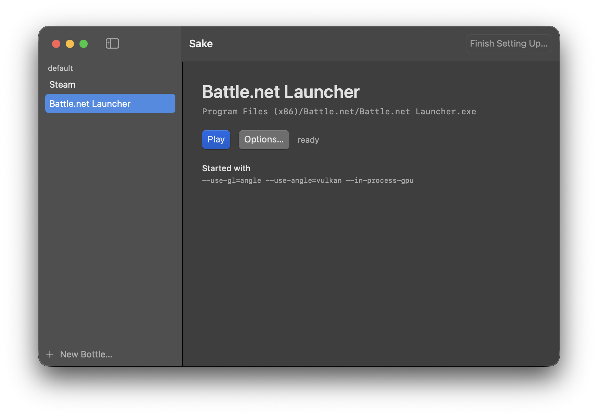

# sake

An open source macOS app for running Windows games on Apple silicon — MIT-licensed, with a
GUI, so none of it takes a terminal.



## Status

Playing here now:

- **Diablo IV**
- **Steam**

I wrote sake to play those two, and that is as far as it has been taken — one person, one
Mac. If you get something else running with it I would like to hear about it, and if you
cannot, that is worth hearing too.

## What it does

The app answers whether this Mac can do the rest — Apple silicon, Rosetta 2, the Command
Line Tools, Apple's Game Porting Toolkit, room on disk — then walks six steps, one screen
at a time:

1. download the sources and check them against known hashes
2. unpack them and build the tools and libraries Wine is configured against
3. build CrossOver's Wine itself, with the patches in `patches/`
4. guide Apple's D3DMetal in from an image you mounted, and unmount it again
5. make a bottle — one Wine prefix, which is where a game lives
6. put a game in it — its own installer, the one you downloaded, runs inside the bottle

After that the library is where you live. A bottle holds titles you added; a title is a
program in that bottle, its name, the arguments it starts with and any environment of its
own. Picking a program that
carries `libcef.dll` fills those arguments in with what a Chromium client needs, because
that is the one thing this stack is known to require and easy to forget. A title's name and
arguments can be changed afterwards, a bottle can be renamed or thrown away, and the app
menu has an Uninstall that takes away everything sake made. All of it goes to the Trash, so
it can be put back.

## Requirements

- Apple silicon with Rosetta 2
- macOS 15 or newer
- The Xcode Command Line Tools
- Apple's Game Porting Toolkit dmg — a free Apple ID is enough
- ~10 GB for sources and build output, plus whatever the game needs

Nothing is installed into `/usr/local`, `/opt/local` or `/nix`. sake keeps the engine and
the bottles under `~/Library/Sake`, and its build output under `~/Library/Caches/Sake`.

## Getting it

```sh
brew tap typester/sake
brew install --cask typester/sake/sake
```

Apple silicon and macOS 15 or newer; the cask refuses to install anywhere else. The app is
ad-hoc signed and not notarised, so Gatekeeper will stop it on first launch — allow it in
System Settings > Privacy & Security, or install with `--no-quarantine`. Nobody here has
run that first launch on a second Mac.

Or build it yourself:

```sh
git clone https://github.com/typester/sake.git
cd sake
./scripts/build-app.sh --release
```

That leaves `target/Sake.app`, which you can drag to `/Applications`. It is the path this
repository has actually taken.

## Using it

Open the app. The setup wizard comes up when the six steps are not finished and stays out of
the way when they are. It runs for tens of minutes, mostly compiling, and sends you to
Apple's download page once, for the toolkit.

When it is done, the library has a bottle in it. Select the bottle and **Install from an
Installer…** runs the game's installer inside it, with Rename and Delete alongside. Once
the game is installed, **Add a Title…** is what puts it in the library: pick its `.exe`
inside the bottle, keep or change the arguments that were filled in, and it appears with a
Play button.

For a launcher like Battle.net, start the launcher and press Play inside it. sake
deliberately does not offer a button that starts Diablo IV directly: the client only hands
out a login token after that press, so a direct start reaches the game and then fails on the
token. `docs/runtime.md` has the measurements behind that.

**[`docs/getting-started.md`](docs/getting-started.md) walks one game through all of this
with screenshots** — Diablo IV, from a Mac with nothing on it to a character on screen.

## Why build Wine at all

The piece that makes DirectX 12 work on macOS is Apple's closed D3DMetal, and the Wine-side
glue it plugs into lives in `dlls/winemac.drv/d3dmetal.c`. That glue is LGPL, so CodeWeavers
publish it, and that is what makes "build the same Wine yourself" a real option rather than
wishful thinking. Upstream Wine does not have it.

**D3DMetal itself is not redistributable**, so sake will never ship it, download it for you,
or take it out of an installed CrossOver — it guides you through downloading Apple's Game
Porting Toolkit yourself, mounts the image inside it, copies out the part it needs, and
unmounts it again. See `docs/licensing.md`.

## What is here

| | |
|---|---|
| `Sources/SakeKit/` | the layout, a subprocess runner, the preflight checks, the source fetcher, the prefix build, the Wine build, the patch step, the D3DMetal step, the bottle, the import, the installer, the titles, starting one, the bundle that puts it in Game Mode, how big a tree is, and the uninstall |
| `Sources/sake/` | the SwiftUI app — two windows, kept thin |
| `patches/` | the changes sake makes to Wine's own code — LGPL-2.1-or-later, not MIT; `patches/README.md` says where each came from |
| `docs/` | how the thing actually has to work, what breaks when it doesn't, and how to play one game |
| `assets/` | the app icon, the code that draws it, the screenshot above, and the guide's under `getting-started/` |
| `scripts/build-app.sh` | builds `target/Sake.app` |
| `scripts/make-icon.sh` | redraws `assets/Sake.icns` |
| `scripts/test.sh` | runs the tests |

## Building

Requires the Xcode Command Line Tools. Xcode is not needed, and there is no Xcode project.

```sh
./scripts/build-app.sh            # target/Sake.app
./scripts/build-app.sh --release  # plus a zip
./scripts/test.sh                 # the tests
```

On macOS 27 the Command Line Tools default to the macOS 27.0 SDK, which SwiftUI cannot be
built against without a macro plugin the CLT do not ship. `build-app.sh` detects this and
falls back to a macOS 26 SDK, printing what it did. Override with `SDKROOT` if needed. See
`CLAUDE.md` for the full story.

## Documentation

`docs/` is the real content of this repository. Every claim in it names where and when it was
measured. Much of it is still the prototype's; the sections sake has measured itself say so
and carry their own date.

| file | what it covers |
|---|---|
| `docs/getting-started.md` | the one written for using sake rather than building it: Diablo IV, step by step, with screenshots |
| `docs/roadmap.md` | the goal, the phases, and where Swift stops and subprocesses start |
| `docs/wine-build.md` | building Wine from CrossOver's sources; the flags that cannot be dropped |
| `docs/runtime.md` | creating a prefix, the three settings that make games run, what pressing Play actually does, controllers, taking a bottle down, and how to tell four failure states apart |
| `docs/licensing.md` | what may and may not be redistributed, and why D3DMetal is unavoidable |
| `docs/layout.md` | where files go, why importing a 100 GB game costs nothing and removing it returns nothing either, why nothing mutable lives in the app bundle, and what pins a built tree to its path |

## Licence

MIT, except `patches/`: patches against Wine's own source are derivatives of LGPL code and
are LGPL-2.1-or-later. See `docs/licensing.md`.
