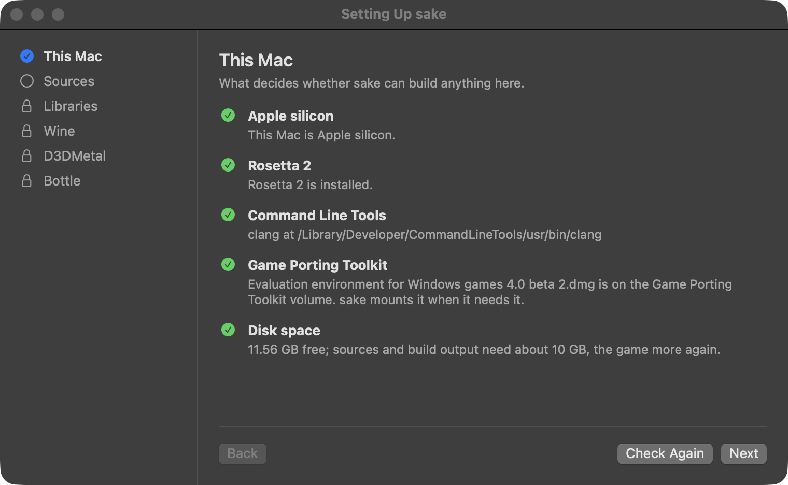
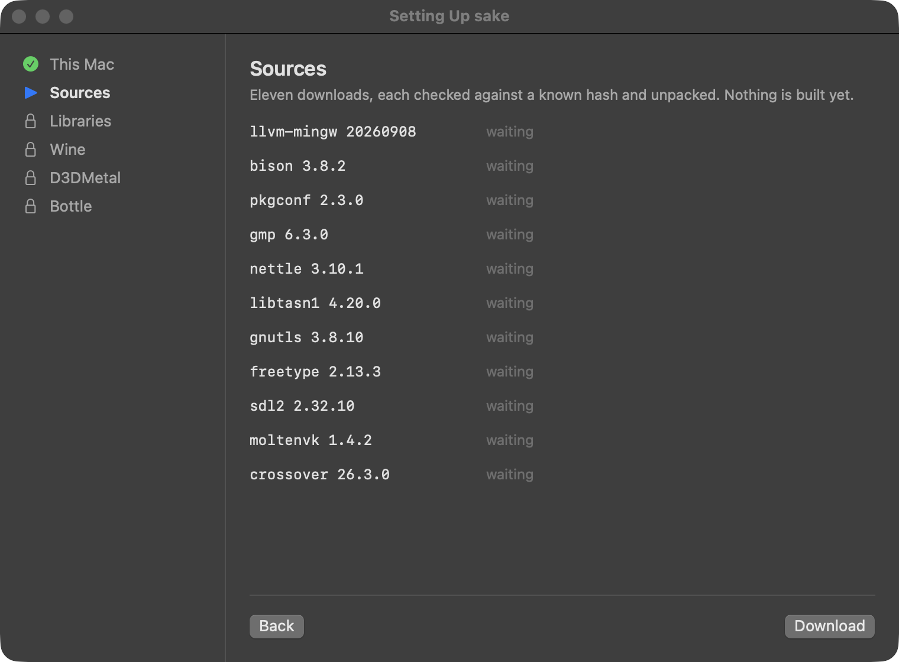
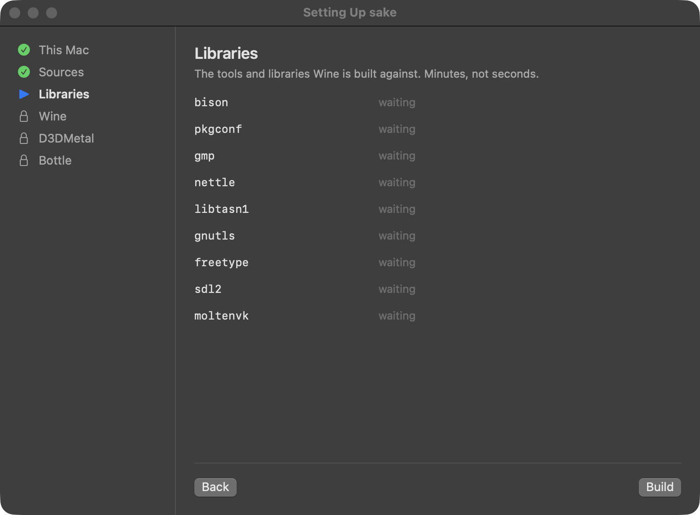
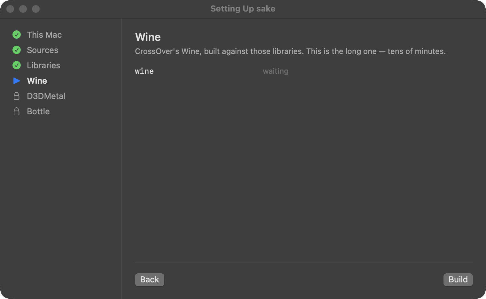
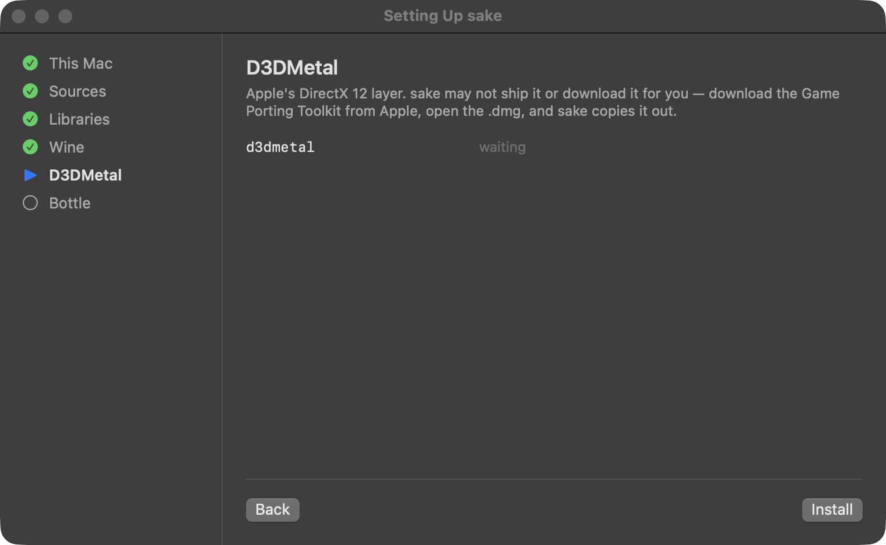
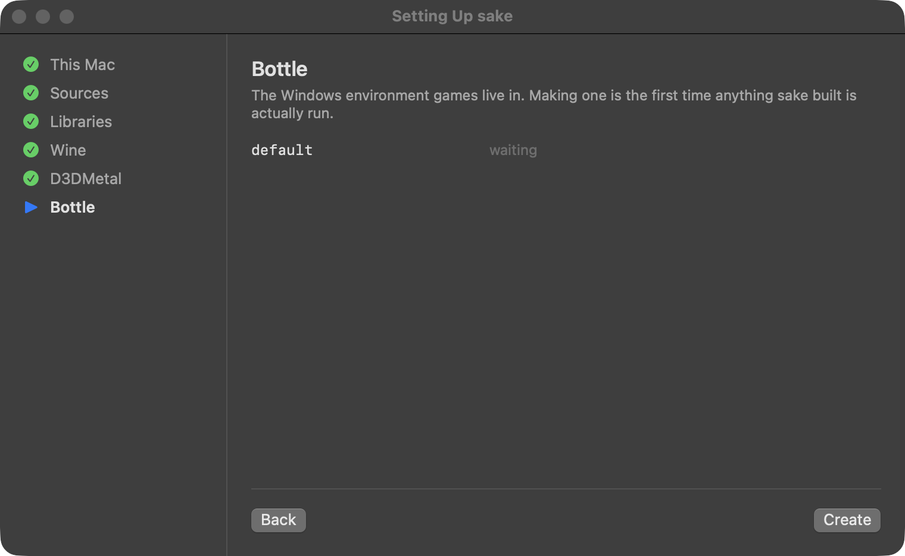
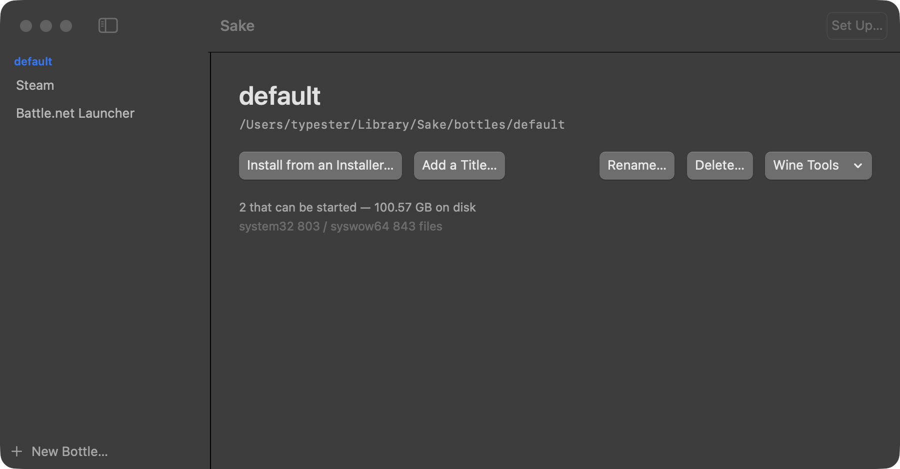
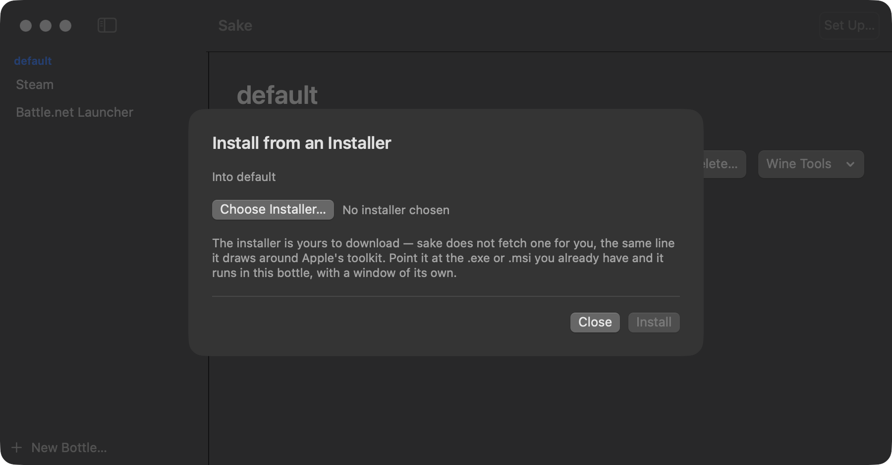
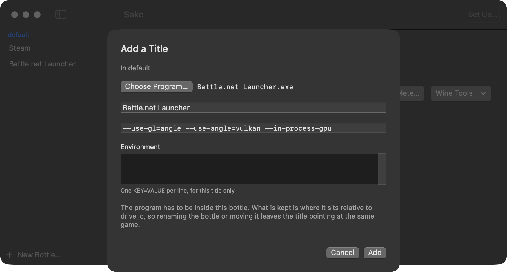
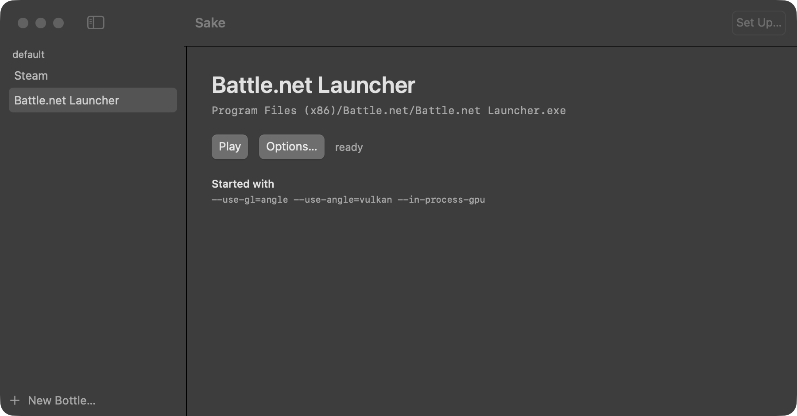

# Getting started: Diablo IV

Diablo IV on an Apple silicon Mac, from nothing installed to a character on screen.

## Before you start

- An Apple silicon Mac with Rosetta 2 — `softwareupdate --install-rosetta`.
- macOS 15 or newer, and the Xcode Command Line Tools — `xcode-select --install`.
- Apple's Game Porting Toolkit `.dmg` — **4.0 beta 2**, which is what the engine here is built
  against — from <https://developer.apple.com/download/all/>. A free Apple ID is enough. sake
  cannot fetch this for you; `docs/licensing.md` says why.
- A Battle.net account that owns Diablo IV, and Blizzard's installer for the client. sake does
  not fetch that either.
- About 10 GB free for sake, and about 90 GB more for the game.

sake keeps the engine and the bottles in `~/Library/Sake`, and downloads, build output and logs
in `~/Library/Caches/Sake`. **Uninstall sake…** in the app menu takes both to the Trash.

## 1. Install sake

```sh
brew tap typester/sake
brew install --cask sake
```

The app is not notarised, so Gatekeeper stops it the first time: allow it in System Settings >
Privacy & Security, or install with `--no-quarantine`.

## 2. Set sake up

Open sake. The wizard opens itself until the six steps are done; afterwards **Set Up…** in the
toolbar brings it back.

### This Mac



Five checks, and nothing below unlocks until they all pass. Install whatever is missing, then
press **Check Again**.

### Sources



Press **Download**. Eleven files, ten of them checked against a hash sake carries; CrossOver's
own tarball is the exception. Nothing is built yet.

### Libraries



Press **Build**. Minutes. SDL2 is one of these, and it is what makes a controller work later.

### Wine



Press **Build** and leave it alone. The app warns of tens of minutes; on ten cores here it took
4m40s.

### D3DMetal



Download Game Porting Toolkit 4.0 beta 2 from Apple, open the `.dmg`, and press **Install**. sake
copies what it needs out of the image and unmounts it. You only need the image once.

### Bottle



Press **Create**. A bottle is one Windows environment and the game goes inside it. This one is
called `default`.

## 3. Install the Battle.net client

Download `Battle.net-Setup.exe` from Blizzard, then select the bottle in the library.



**Install from an Installer…**, choose the `.exe`, **Install**. Blizzard's installer runs in a
window of its own; click through it as you would on Windows.



When it closes, the sheet offers **Add a Title…**, which is the next step.

If Diablo IV is already installed under CrossOver, the bottle offers **Import from CrossOver…**
instead. It clones the game rather than copying it, so it costs no disk.

## 4. Add the launcher as a title



**Add a Title…**, then **Choose Program…**. The panel opens inside the bottle; the launcher is
`Program Files (x86)/Battle.net/Battle.net Launcher.exe`. The name and the arguments fill in by
themselves. **Add**.

**Leave the arguments alone.** Without `--in-process-gpu` the login form is drawn but never
appears, and without the two ANGLE flags the client's GPU process exits. `docs/runtime.md` has
the measurements.

## 5. Install the game

Select the title and press **Play**. Sign in, and install Diablo IV from inside the client:
about 90 GB.



## 6. Play

Start Diablo IV from the Battle.net launcher.

Enjoy!

## A controller

Nothing to set up. The engine is built with SDL2, so a controller should work.

## If it does not start

- Every run writes a log under `~/Library/Caches/Sake/build` — `title-<id>.log` for a title,
  `install-<name>.log` for an installer. The window shows only the last line of it.
- **Wine Tools** on the bottle opens winecfg, regedit, the uninstaller and the task manager.
- `docs/runtime.md` tells four failure states apart by thread count, memory and Metal mappings.
  Read that before deciding a build is broken.
